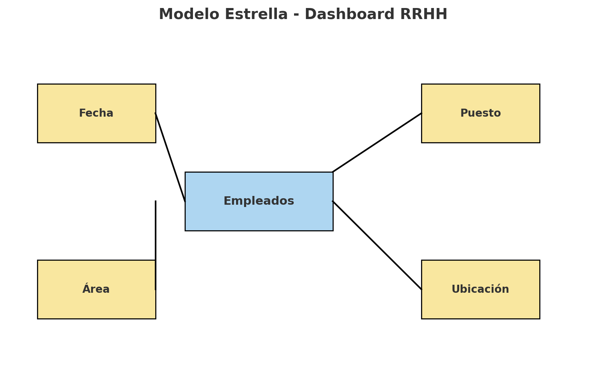
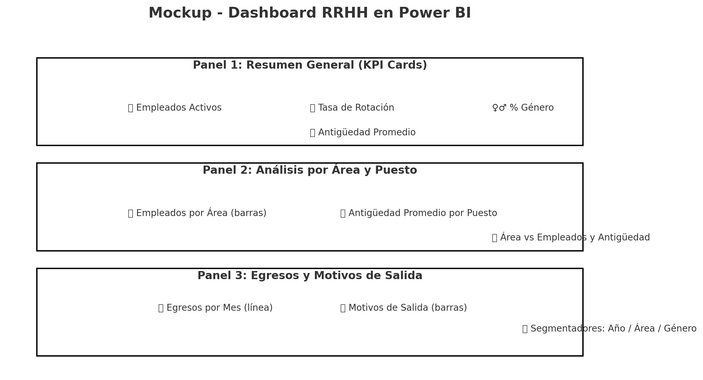

# 📊 Dashboard de Recursos Humanos en Power BI - Simulación 2025

Este proyecto muestra cómo construir un **Dashboard de Recursos Humanos (RRHH)** usando **Power BI** con datos simulados.
Incluye métricas clave, paneles visuales y buenas prácticas de modelado de datos.

---

## 📂 Archivos incluidos

- `base_datos_rrhh_simulada.xlsx` → Dataset de empleados simulados (200 registros)
- `base_datos_rrhh_simulada_1000.xlsx` → Dataset de empleados simulados (1000 registros)
- `tabla_fechas_calendar.xlsx` → Tabla de fechas (Calendar) para modelado en Power BI
- `Pack_Medidas_DAX_RRHH.txt` → Medidas DAX listas para copiar en Power BI

---

## 🛠️ Pasos principales para el Dashboard

1. **Cargar datos en Power BI**
   - Abrir Power BI Desktop
   - `Obtener datos` → `Excel`
   - Importar `base_datos_rrhh_simulada_1000.xlsx`
   - Cargar también `tabla_fechas_calendar.xlsx`

2. **Transformar datos (Power Query)**
   - Asegurar tipos correctos (fechas, números, texto)
   - Limpiar columna `Asistencia_Mensual` (convertir a número)
   - Revisar columnas de antigüedad y fechas

3. **Modelado**
   - Relacionar `Empleados[Fecha_Ingreso]` con `Fecha[Date]`
   - Crear relación inactiva con `Fecha_Egreso` (activar en medidas con `USERELATIONSHIP`)
   - Marcar la tabla `Fecha` como tabla de fecha

   ### 📐 Modelo de datos (Esquema Estrella)
   

4. **Medidas DAX**
   - Copiar/pegar desde `Pack_Medidas_DAX_RRHH.txt`
   - Incluye: empleados activos, egresos, rotación, % género, antigüedad promedio, headcount dinámico

5. **Visualizaciones**
   - **Panel 1: Resumen general (KPI cards)**
     - Total empleados activos
     - Tasa de rotación
     - % de género
     - Antigüedad promedio
   - **Panel 2: Análisis por área y puesto**
     - Cantidad de empleados por área (barras)
     - Promedio de antigüedad por puesto (columnas)
   - **Panel 3: Egresos y motivos de salida**
     - Línea: egresos por mes
     - Barras: motivos de salida
     - Segmentadores: Año, Área, Género
   - **Extra**: Mapa por ubicación (empleados por ciudad)

   ### 🎨 Mockup del Dashboard
   

## 👨‍💻 Autor
Proyecto generado como simulación para prácticas en **Power BI**.  
Incluye dataset ficticio, tabla de fechas y medidas DAX predefinidas.
